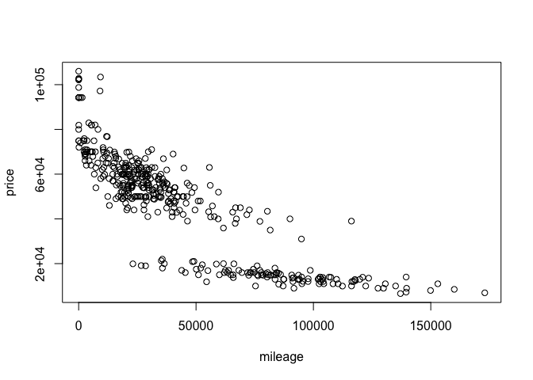
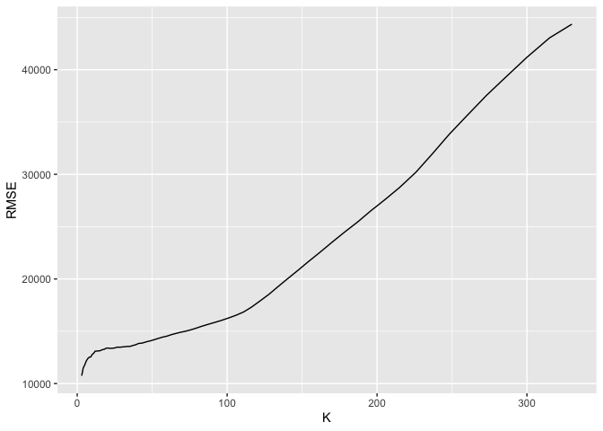
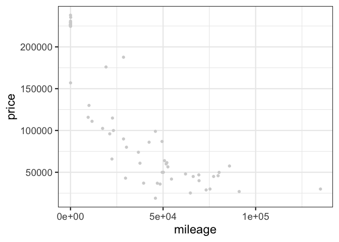
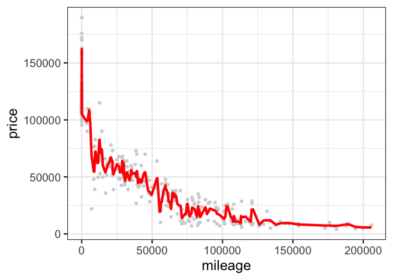
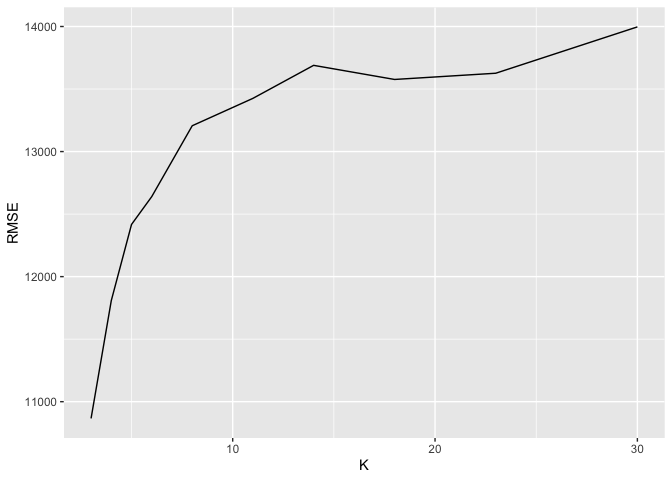
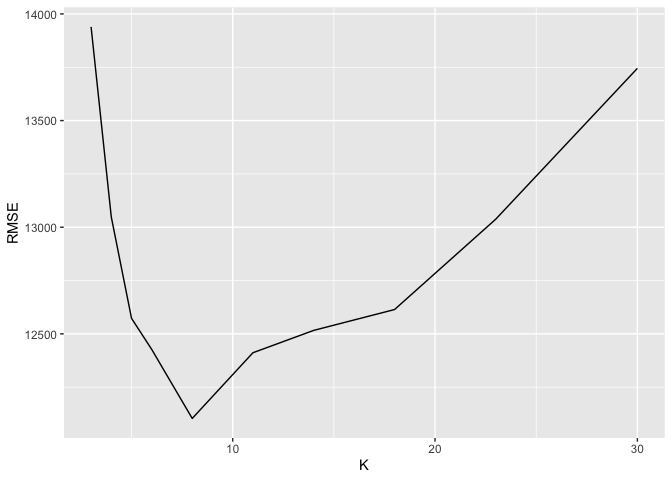

    ## [1] 416  17

By drawing the scatter plot, we can see the basic relationship between
mileage and the price. Concentrating on the data of sclass 550, and then
make the train and test split, and we set the number of train set as the
80% of the whole data set, and the test set is the left ones. Also, we
concentrate on the data of sclass550 first.

    ##      id trim subTrim condition isOneOwner mileage year  color displacement
    ## 1 22676  350    unsp       New          f      18 2013  Black        3.0 L
    ## 2 29303  350    unsp       CPO          f     791 2013  White        3.0 L
    ## 3 35896  350    unsp       CPO          f    5864 2013  Black        3.0 L
    ## 4  6235  350    unsp      Used          f    7000 2012  White        3.0 L
    ## 5 18011  350    unsp       CPO          f    7308 2012 Silver        3.0 L
    ## 6 51580  350    unsp       CPO          f    8227 2013  White        3.0 L
    ##     fuel state region   soundSystem wheelType wheelSize featureCount price
    ## 1 Diesel    MA    New          unsp      unsp      unsp            1 94230
    ## 2 Diesel    WA    Pac       Premium     Alloy      unsp           79 73995
    ## 3 Diesel    GA    SoA Harman Kardon      unsp      unsp           40 69991
    ## 4 Diesel    MA    New       Premium     Alloy      unsp           78 82000
    ## 5 Diesel    FL    SoA          unsp      unsp      unsp           63 62900
    ## 6 Diesel    NC    SoA       Premium     Alloy      unsp           61 79990

    ## [1] 11515.83

    ## [1] 10574.4

And then we can draw the graph for the relationship between mileage and
the price by taking K=3 first.

And by calculating the RMSE under different K value, we can generally
draw a graph for the K value and the RMSE for in-sample data. And then
we can draw a graph indicating the relationship between the K and RMSE
for the out of sample.

    ## [1] 330

After that, we move on to another part of dataset as data refers to
sclass65AGM.And conducting the similar process as above.

    ##      id   trim subTrim condition isOneOwner mileage year color
    ## 1 33366 65 AMG    unsp       New          f       1 2015 Green
    ## 2 45262 65 AMG    unsp       New          f       1 2015 Black
    ## 3  6350 65 AMG    unsp       New          f       3 2015  unsp
    ## 4 30053 65 AMG    unsp       New          f       5 2015  Gray
    ## 5  7620 65 AMG    unsp       New          f       8 2015 Black
    ## 6 20798 65 AMG    unsp       New          f       8 2015 Black
    ##   displacement     fuel state region soundSystem wheelType wheelSize
    ## 1         unsp     unsp    AL    ESC     Premium      unsp      unsp
    ## 2        6.0 L Gasoline    IL    ENC     Premium     Alloy      unsp
    ## 3         unsp     unsp    CA    Pac        unsp      unsp      unsp
    ## 4        6.0 L Gasoline    CA    Pac        unsp      unsp      unsp
    ## 5         unsp     unsp    NY    Mid        unsp      unsp      unsp
    ## 6        6.0 L Gasoline    CA    Pac        unsp     Alloy        20
    ##   featureCount  price
    ## 1           36 226235
    ## 2           72 226615
    ## 3           68 224625
    ## 4            1 230085
    ## 5            0 224765
    ## 6           66 237935

Here is a scatter plot of the relationship between mileage and the
price.

Now we can firstly draw a relationship between miles and prices under
the condition K=3

And then generally draw the graph for RMSE under different values of
K,we generally assume the K value is from 0 to 30.

And for the our of sample, the result of relationship of K and RMSE is
here.

    ## [1] 8

And for the optimal K, we can see that for the out of sample data, the
relationship between K and RMSE generally depends on the K optimal
value, which changes over the loop. In this way, we can not receive the
optimal K value in the end. But by seeing the graphs, we can choose a
relatively good value of K.
