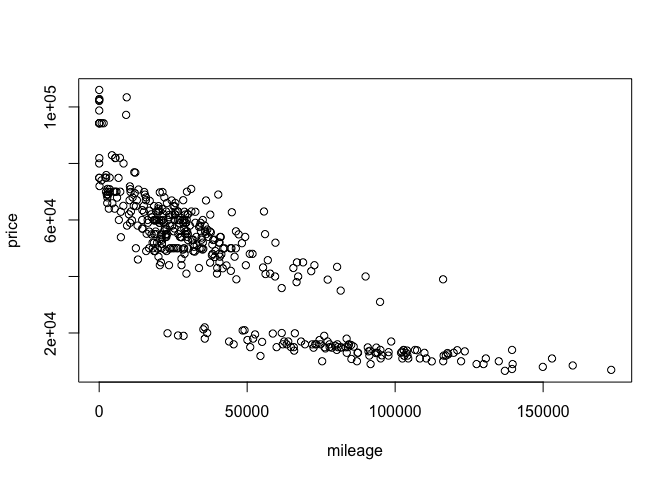
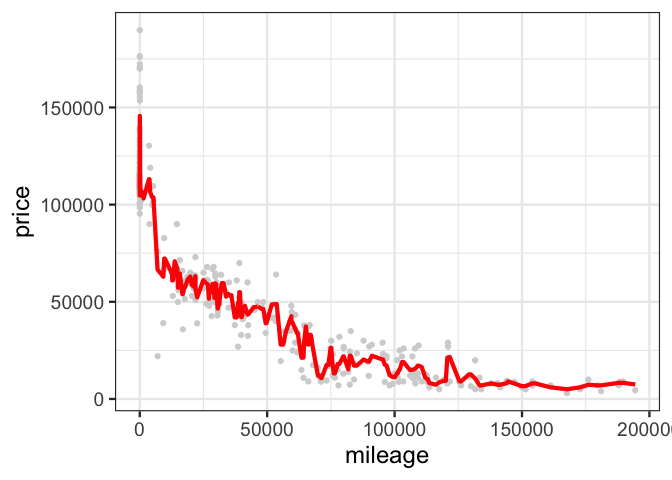
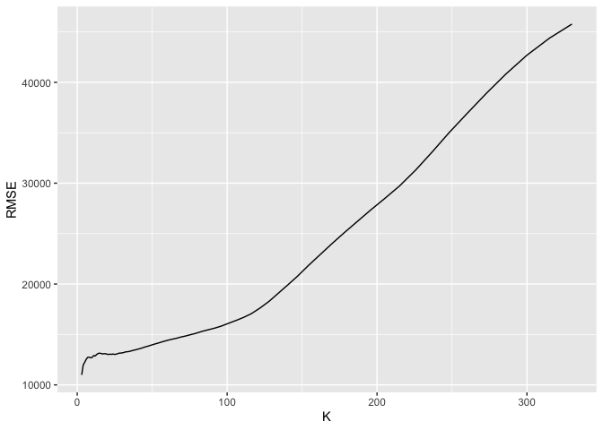
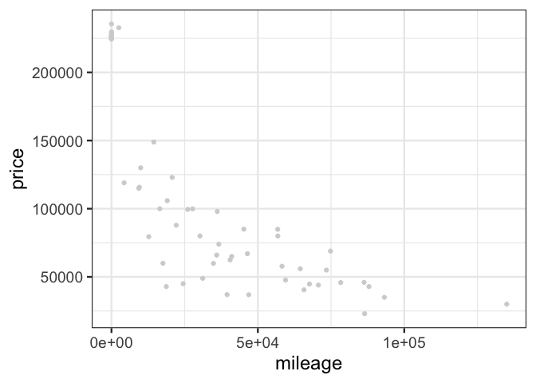
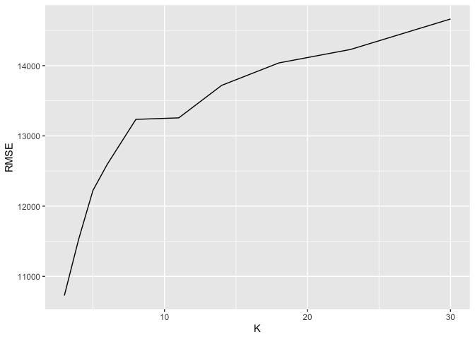
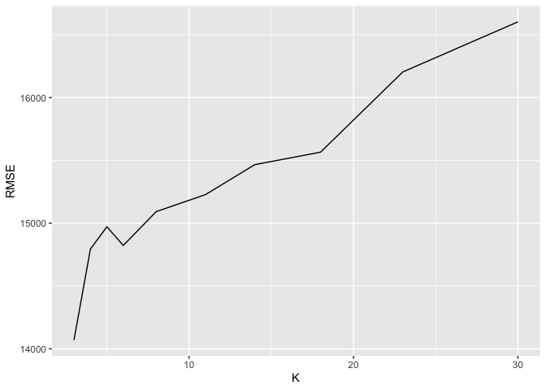

    ## Loading required package: dplyr

    ## 
    ## Attaching package: 'dplyr'

    ## The following objects are masked from 'package:stats':
    ## 
    ##     filter, lag

    ## The following objects are masked from 'package:base':
    ## 
    ##     intersect, setdiff, setequal, union

    ## Loading required package: lattice

    ## Loading required package: ggformula

    ## Loading required package: ggplot2

    ## Loading required package: ggstance

    ## 
    ## Attaching package: 'ggstance'

    ## The following objects are masked from 'package:ggplot2':
    ## 
    ##     geom_errorbarh, GeomErrorbarh

    ## 
    ## New to ggformula?  Try the tutorials: 
    ##  learnr::run_tutorial("introduction", package = "ggformula")
    ##  learnr::run_tutorial("refining", package = "ggformula")

    ## Loading required package: mosaicData

    ## Loading required package: Matrix

    ## Registered S3 method overwritten by 'mosaic':
    ##   method                           from   
    ##   fortify.SpatialPolygonsDataFrame ggplot2

    ## 
    ## The 'mosaic' package masks several functions from core packages in order to add 
    ## additional features.  The original behavior of these functions should not be affected by this.
    ## 
    ## Note: If you use the Matrix package, be sure to load it BEFORE loading mosaic.

    ## 
    ## Attaching package: 'mosaic'

    ## The following object is masked from 'package:Matrix':
    ## 
    ##     mean

    ## The following object is masked from 'package:ggplot2':
    ## 
    ##     stat

    ## The following objects are masked from 'package:dplyr':
    ## 
    ##     count, do, tally

    ## The following objects are masked from 'package:stats':
    ## 
    ##     binom.test, cor, cor.test, cov, fivenum, IQR, median,
    ##     prop.test, quantile, sd, t.test, var

    ## The following objects are masked from 'package:base':
    ## 
    ##     max, mean, min, prod, range, sample, sum

    ## [1] 416  17

By drawing the scatter plot, we can see the basic relationship between
mileage and the price. Concentrating on the data of sclass 550, and then
make the train and test split, and we set the number of train set as the
80% of the whole data set, and the test set is the left ones. Also, we
concentrate on the data of sclass550 first.

    ##      id trim subTrim condition isOneOwner mileage year color displacement
    ## 1 38588  350    unsp       New          f      25 2013 Black        3.0 L
    ## 2 37244  350    unsp      Used          f     111 2013 Black        3.0 L
    ## 3 10102  350    unsp      Used          f    2747 2013 Black        3.0 L
    ## 4 43132  350    unsp      Used          f    3257 2013 Black        3.0 L
    ## 5 29969  350    unsp      Used          t    4308 2013 White        3.0 L
    ## 6 30567  350    unsp      Used          f    4978 2013 Black        3.0 L
    ##     fuel state region   soundSystem wheelType wheelSize featureCount price
    ## 1 Diesel    MA    New          unsp      unsp      unsp            1 94230
    ## 2 Diesel    VA    SoA          unsp      unsp      unsp            5 71995
    ## 3 Diesel    VA    SoA          unsp      unsp      unsp            0 67995
    ## 4 Diesel    VA    SoA          unsp      unsp      unsp            6 63995
    ## 5 Diesel    CA    Pac          unsp      unsp      unsp            0 82910
    ## 6 Diesel    CA    Pac Harman Kardon      unsp      unsp           41 69990

    ## [1] 12341.4

    ## [1] 9968.298

And then we can draw the graph for the relationship between mileage and
the price by taking K=3 first.

And by calculating the RMSE under different K value, we can generally
draw a graph for the K value and the RMSE for in-sample data. And then
we can draw a graph indicating the relationship between the K and RMSE
for the out of sample.

    ## [1] 330

After that, we move on to another part of dataset as data refers to
sclass65AGM.And conducting the similar process as above.

    ##      id   trim subTrim condition isOneOwner mileage year color
    ## 1  6350 65 AMG    unsp       New          f       3 2015  unsp
    ## 2 19472 65 AMG    unsp       New          f       3 2015  unsp
    ## 3 32025 65 AMG    unsp       New          f       7 2015 Black
    ## 4 31370 65 AMG    unsp       New          f       8 2015 Black
    ## 5 33369 65 AMG    unsp       New          f       9 2015 Black
    ## 6  7619 65 AMG    unsp       New          f      10 2015 Black
    ##   displacement     fuel state region  soundSystem wheelType wheelSize
    ## 1         unsp     unsp    CA    Pac         unsp      unsp      unsp
    ## 2        6.0 L Gasoline    CA    Pac         unsp      unsp      unsp
    ## 3        6.0 L Gasoline    CA    Pac         unsp      unsp      unsp
    ## 4        6.0 L     unsp    CA    Pac      Premium     Alloy      unsp
    ## 5        6.0 L Gasoline    TX    WSC Bang Olufsen      unsp        20
    ## 6        6.0 L Gasoline    NY    Mid      Premium     Alloy      unsp
    ##   featureCount  price
    ## 1           68 224625
    ## 2          104 224625
    ## 3            1 224625
    ## 4           81 226135
    ## 5           65 226625
    ## 6           61 226115

Here is a scatter plot of the relationship between mileage and the
price.

Now we can firstly draw a relationship between miles and prices under
the condition K=3

And then generally draw the graph for RMSE under different values of
K,we generally assume the K value is from 0 to 30.

And for the our of sample, the result of relationship of K and RMSE is
here.

    ## [1] 3

And for the optimal K, we can see that for the out of sample data, the
relationship between K and RMSE generally depends on the K optimal
value, which changes over the loop. In this way, we can not receive the
optimal K value in the end. But by seeing the graphs, we can choose a
relatively good value of K.
