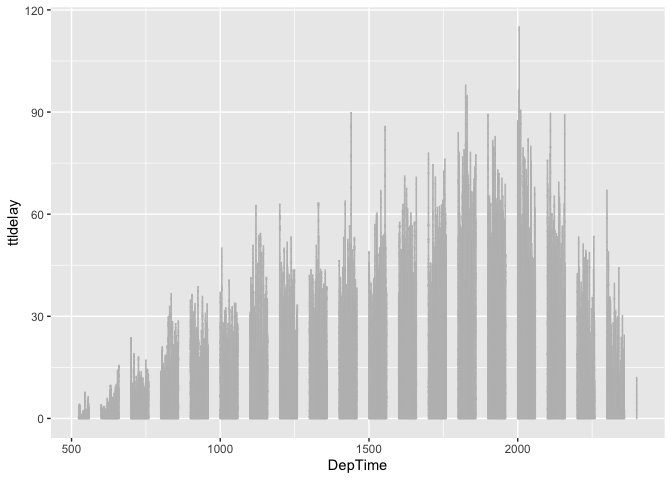
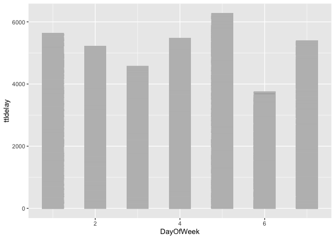
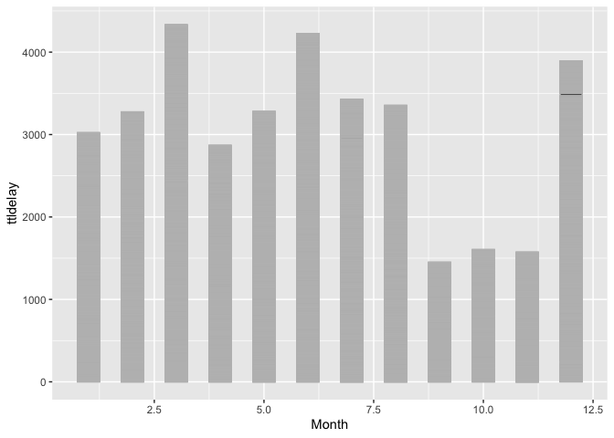
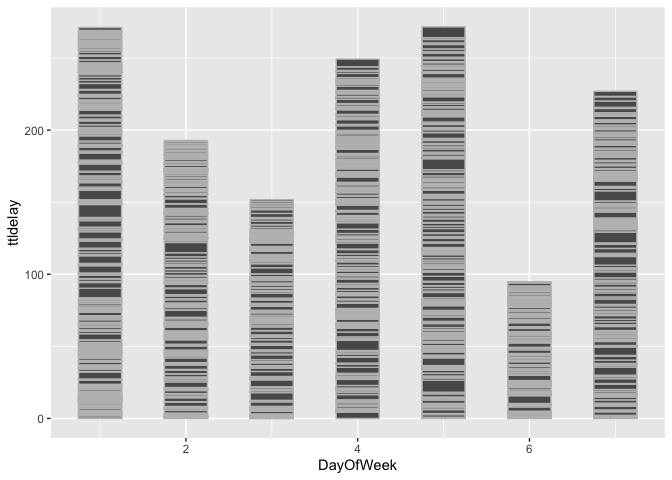

Question 1
================

Firstly, in order to conclude the result of delay of flight more
concisely, I set up a new variable named ttldelay, as the total amount
of departuring delay and the arriving delay for the flight. And transfer
the metrics of the delay time into hours, not as the minutes before.
Also, I set up a new data set named DepAus, in order to select the
flight whose departure time is later than 5am, which is more practical
in our real life.
<!-- -->
From the bar chart, we can see that the best time in a day, considering
the least delay of departuring and arrival time, it is in the early
morning around 6 am. However, it is not really practical for most
people, because early morning is not convenient for the transportation.
So we can also see that there is an increasing delay time from early
morning to the noon. In this way, we can suggest the passanger to arrive
as early as they can to catch the flight.
<!-- -->

    ## $title
    ## [1] "Total Delay in a week"
    ## 
    ## attr(,"class")
    ## [1] "labels"

From the graph of the total delay in a week, we can see that the least
delay time in the week is Saturday, which is just less than Wednesday.
In this way, we can say that Saturday and Wednesday are relatively both
suitable choice to avoid the total delay.
<!-- -->

    ## $title
    ## [1] "Total Delay in a year"
    ## 
    ## attr(,"class")
    ## [1] "labels"

From the bar chart to indicate the delay time of month in a year, we can
clearly see that Septemer will offer the least delay time, while October
and November will also offer a relatively little delay time, comparing
to the other months. However, March, June and December will lead to a
great amount of delay, passengers could choose to avoid these three
months to go out. Furthermore, in order to figure out in which day,
September will offer the relatively little time for delay, I set up the
new data set and deleted the data of other months.

And then plot the charts in terms of the day of week in September, we
can still say that on Saturdays in September, it is beneficial to take
flights by receiving the least delay time.
<!-- -->
In a conclusion, we can predict and recommend the passangers to take
flights in September, Octorber and Novermber, and choose Saturday. And
they can also go out as early as they can to avoid the unnecessarydelay.
