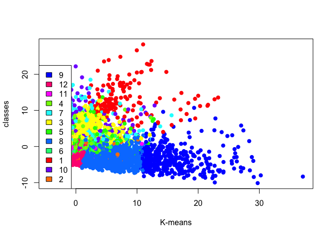

Question 4
================

Firstly, we should scale and center the data, and also extract the
centers and the scales from the data. By generally checking the data
from social\_marketing dataset, we plan to not take the spam and adult
part into consideration when we think about the marketing segment this
time.

Then we plan to find the number of clusters by finding k\_mean.

We plan to try to find the optimal K\_mean based on the elbow plot for
clustering,and in order to make sure that the SSE within the cluster is
relatively low.

From the following elbow plot, we can see the SSE within the cluster
vesus K. And this is going to go down with K and we’re going to
basically find where it stops going down all that fast.

So in this elbow plot, we know that when K-mean=10, the SSE=18000. And
when k=20, the SSE is around at 16000, so I plan to choose k\_mean as 12
and use it to cluster.

    Warning: did not converge in 10 iterations
    
    Warning: did not converge in 10 iterations
    
    Warning: did not converge in 10 iterations
    
    Warning: did not converge in 10 iterations

<!-- -->

Then, we can try k\_means clustering with considering the PCA scores.

In ordet to make it clear, we generally show how the PCA1 and PCA2 look
like.

    Importance of components:
                             PC1    PC2    PC3    PC4     PC5     PC6     PC7
    Standard deviation     5.195 4.0282 3.8075 3.7078 3.21592 2.63072 2.13444
    Proportion of Variance 0.216 0.1298 0.1160 0.1100 0.08274 0.05537 0.03645
    Cumulative Proportion  0.216 0.3458 0.4617 0.5717 0.65448 0.70985 0.74630
                               PC8     PC9    PC10    PC11   PC12    PC13
    Standard deviation     2.02608 1.82266 1.44695 1.36768 1.2893 1.26840
    Proportion of Variance 0.03284 0.02658 0.01675 0.01497 0.0133 0.01287
    Cumulative Proportion  0.77914 0.80572 0.82247 0.83744 0.8507 0.86361
                              PC14    PC15    PC16    PC17    PC18    PC19
    Standard deviation     1.23037 1.21514 1.12994 1.08680 1.07053 0.98946
    Proportion of Variance 0.01211 0.01181 0.01021 0.00945 0.00917 0.00783
    Cumulative Proportion  0.87572 0.88753 0.89775 0.90720 0.91637 0.92420
                              PC20    PC21    PC22    PC23    PC24    PC25
    Standard deviation     0.96864 0.94501 0.92286 0.90292 0.87677 0.87362
    Proportion of Variance 0.00751 0.00714 0.00681 0.00652 0.00615 0.00611
    Cumulative Proportion  0.93170 0.93885 0.94566 0.95219 0.95834 0.96444
                              PC26    PC27    PC28    PC29    PC30    PC31
    Standard deviation     0.85706 0.84120 0.80194 0.74352 0.72553 0.71163
    Proportion of Variance 0.00588 0.00566 0.00515 0.00442 0.00421 0.00405
    Cumulative Proportion  0.97032 0.97598 0.98113 0.98555 0.98976 0.99381
                              PC32    PC33
    Standard deviation     0.65588 0.58595
    Proportion of Variance 0.00344 0.00275
    Cumulative Proportion  0.99725 1.00000

``` 
                         PC1         PC2
current_events   0.013586204  0.04168688
travel           0.005446709  0.19518833
photo_sharing    0.106607662  0.35086526
uncategorized    0.024221313  0.03378822
tv_film          0.005013021  0.06093009
sports_fandom    0.020222401  0.11619035
politics         0.002972377  0.28880326
food             0.095742095  0.06000650
family           0.018343417  0.05971055
home_and_garden  0.014467364  0.02234408
music            0.023045084  0.05678880
news             0.017175898  0.13604921
online_gaming    0.013950537  0.29506263
shopping         0.036364035  0.11448894
health_nutrition 0.818370614 -0.27916539
college_uni      0.002075209  0.35470212
sports_playing   0.018086196  0.08817966
cooking          0.336817136  0.48797048
eco              0.037660102  0.01686240
computers        0.013989361  0.09426921
business         0.011348399  0.03437327
outdoors         0.146248382 -0.02429196
crafts           0.019991048  0.03265181
automotive       0.003060715  0.07930400
art              0.019037628  0.05540921
religion         0.027814610  0.09577868
beauty           0.057672785  0.17553168
parenting        0.028410162  0.07655781
dating           0.035554319  0.04104439
school           0.019387158  0.06551356
personal_fitness 0.390875042 -0.11169165
fashion          0.092609705  0.26357926
small_business   0.004284617  0.03080005
```

By classifying the PCA of the social marketing data, we can see the
different clusters have different features for the PCA.

Cluster 6：In this cluster, there are users/accounts with high PCA1 score
and low PCA2 score.

Cluster 3 ：This cluster comprises of customers with low PCA1 score and
high PCA2 score.

Cluster 8 and 9： These two cluster both have medium PCA1 and PCA2 score.
<!-- -->

We can also produce analysis by taking more PCA characteristics into
consideration. For example, analyze the relationship between clusters
and PCAs.

The following graph shows some obvious features.

Cluster 3 and Cluster 9: These two cluster has high PCA3 scores and PCA4
scores.

Cluster 6: This cluster comprises of users with medium PCA3 and PCA4
scores.

<!-- -->

In this way, the companies could push the different products to
different users/consumers considering their different PCA features.

Then we can try to run kmeans with 12 clusters and starts 50

After clustering, we can figure out which users belong to use clusters.
Considering there are thousands of consumers here, we just show the
situation in cluster 1 and cluster 2.

But that already could show the companies could sell the products to
different clusters, and they can find the specific consumers by knowing
which users belong to which
    cluster.

    n467yj1st l38sqjp9e y6tboa7cj t5iv3am2s lni6dq45w e149zrcqd u12ktqag3 
           10        12        48        88       115       274       287 
    lif7b6acy l5wginmo6 znv4kgqlw tq75k21iw uj2rxmitf 3wqcmbx9y jgvodmxn8 
          299       305       323       357       362       368       372 
    msjfe2w7n wxvgo7tr2 ne39rq5vl epzgawyvu 68ylut5dp 4xlar9m5v pi7oetbf2 
          384       445       453       499       515       530       533 
    rqfji2cbu umz9ypflv jl1g3eqs5 8rt6g3n7u 35sjzrlv4 7zwh59ub1 r8twv957y 
          539       540       544       578       641       650       684 
    lw593gk6o 7txlr8v45 spqjlnia3 5oge7tvmz lqmnokvs9 o2wd4l8se g1tm3z58f 
          705       734       764       790       806       810       820 
    u2h5bwgij 47xyqmrv3 yu4b9q1xs 9mzg7nft2 rkf7sybo6 6dnpemu2y b8dov9zei 
          829       865       872       883       888       919       933 
    53e1m4jnt 6n1bahgw5 xfs3ji2mp 4wg3qhax2 vcqeb5lyr 8wtmul7dr jfrmg8n2t 
          934       943       955       971      1003      1019      1042 
    d2ge9xc6m f9bweuctv 4rwmct1j7 qlv8zn19d 4a7pcj5v6 2k4jvaqcl z415huamx 
         1050      1061      1066      1093      1103      1106      1146 
    84aeyql7w hbcgwtrxy cungaw31m m62ibu9cg 4eimd3kyt wlyejocp5 otb3lhz7f 
         1160      1181      1182      1215      1249      1293      1318 
    oktcqdb3a txyump81e gwk2pytf4 tua5fmlw3 2473jcbxi hv937ymt2 lpemvgy6w 
         1334      1342      1380      1392      1497      1552      1667 
    6gwz1jfye cs3j8eu1a zs8get6hd gaf68inmx lejq2dwfi gmn78162z x4e6g5odw 
         1672      1694      1700      1712      1713      1716      1734 
    znjocxmlk dbkfl7trm 7fd3ouh9w 1gwylz2m4 4nbp95io3 4vwpxtbfz x3a917fl8 
         1750      1760      1773      1776      1843      1851      1870 
    hosifwyxa wp5yqrgbd xsi6lhj2b qu3a4jf1l xgtc75wu3 hf4ojy57b 4oiuc9g8t 
         1875      1887      1958      1993      2017      2062      2072 
    ft6rn1my5 9bgxaivjd 1voad2uzh unwev39x6 wgqs9zyv7 bp8yzs5ex iruynf35p 
         2079      2092      2133      2183      2227      2240      2261 
    p3orj15vs isavpkrt3 9pq7stdnk t2hok8gu5 dhcnfyzlt iuw1d7qme 1zh6twouf 
         2270      2369      2377      2389      2390      2430      2435 
    8k2fe14zy lb7fh1sn3 pxgz7jlh9 b31ycxstd ihugcadl6 tpjzix35l 9nfizk5lx 
         2437      2440      2459      2495      2506      2507      2517 
    tlor3adby kbpnseag6 w6sb5qekj fi79k5rdc 8132jorxf ewzrilmdo glj5dstfi 
         2527      2528      2541      2554      2620      2630      2641 
    qeugvspx6 3deb6kajp n43ducyel n1isdjkx9 ltvcb1ekm 5uvwsy2gx kri1fha3e 
         2703      2719      2753      2797      2833      2849      2896 
    cyw6u5mzr qr1x97iez zysiu5mga gevnx5mhd gxfy5m4on osp62er3a iaxem9vch 
         2906      2944      3050      3091      3192      3218      3227 
    5v4qbkd7g hclfm2vpy qa453dhm1 odgvb87rl ynrbk4hpt yxmurj8o9 febc5n81s 
         3230      3293      3300      3347      3354      3366      3389 
    ekbf9glyx 1rzg2s5wk 2nluyiore ndb2l95ck ikvyrms4j gr9ibedoz c732p6krf 
         3408      3444      3457      3497      3522      3526      3535 
    ueyjs9th6 p25oj7gzq idpxeb6c1 bopvzdgn9 9yug14lns x2kg8yanj 9zi2alnq5 
         3604      3609      3666      3691      3749      3762      3826 
    lgkd41ezb phqnrae3g w1yghfmz6 cngmxrtha xcnv3rqe9 6eu1mvdct d6rkojiuq 
         3936      3965      3978      3998      4074      4083      4139 
    kcqmbpgn7 1tn2ub54r fbzchtmuv 4o1r7pv3x 69vbeaiu1 u4cn1hox8 935uc7yit 
         4142      4146      4205      4232      4248      4249      4263 
    pfz8h37dx guch6t78n f9v3pedjh lz7dqirja rbzco29am e5lc7vsuz xwg1tc5rv 
         4267      4277      4282      4290      4309      4312      4339 
    95s1g7odc tiy7hjnzq ztu5pnsvc crjufposq x6c47m95s 9q8rfbnpi 5hnitygrv 
         4340      4376      4381      4394      4421      4457      4462 
    ij58ves6h emx8bs7w5 56rfymul2 n85zsxr2w iclt3yhq6 ej5huwkf8 5s4mpulth 
         4469      4498      4499      4515      4549      4561      4574 
    lopaz7k5r n8zvmcut9 5ai8dq4ex 18t4o3yqf bs9fyzkm5 qj1i5vf74 nxwchmyet 
         4600      4601      4611      4613      4617      4659      4714 
    ght2vik58 z2xry4vtg 3nqi5hfry 8xwur4mcj 56p9j2oh4 yesz8aqiw 3l6uc9i18 
         4722      4743      4766      4775      4778      4803      4842 
    6tcuo2wgz nwexpfoy5 unz2rvl9k te8o5hjps fnj4yemkl jwire9o4z f6erid9jt 
         4873      4881      4913      4943      5009      5010      5018 
    6s5r1bi7e py5jf32mb 154wcnkaz 7vk85gqfw thpzinu8m rmdf1yxeo xswn1kg4l 
         5046      5064      5073      5099      5109      5110      5122 
    9j4de37b6 ebg8x27dt gxcdroi2v t2ja547yk qbydaezi2 rxbe2dz5h jwomntulq 
         5194      5219      5226      5295      5319      5392      5398 
    26bvthkum 2nmke6jsg oym135dn6 4iume9tr5 bw6m1u4dr vjaqu8k3w zdfbs3q1v 
         5399      5410      5451      5472      5494      5532      5552 
    5orx2764a t6klhgf7d o7yx8u2i9 g2rf84pvm hbk8jml3d dhfqmxn5k a6vdqbnz4 
         5601      5618      5649      5672      5686      5724      5726 
    x64skmhwa nwgu5ytp4 hqt4egukx wtlozng43 fqc7lkxsb ucetyol1a ietldj7zm 
         5727      5756      5782      5908      5939      5950      5966 
    a37mp41yv fusverdlq upf4vs5oe 7ecukt4hl ug79e1r6p pr48fvxqc 7ek2lahvu 
         5986      6026      6050      6064      6068      6167      6229 
    wnsd3yofl japeuzi5g hjkfsn3yw krqt9hn78 oct1xbuh7 q56hon2bg v58ahpexr 
         6234      6356      6377      6458      6536      6538      6557 
    o1ipqkx3u 27msyined hyekzvsqc inskejz8w wtoa9ki6n z1yslvxf3 dxj3v5y49 
         6567      6599      6601      6636      6654      6698      6706 
    s1yipuft2 zhwq9n7t2 yhgelf67i ewnmjc97u iuegob7ch uic4e7qd9 wsnm7pbt3 
         6753      6756      6766      6775      6794      6814      6837 
    gmen4s5oi c6jsvmol4 glrin2zj8 pn7l45ca6 41y9q3tb6 fy57vmgh3 1amed43kq 
         6850      6859      6866      6907      6913      6953      6965 
    96gjimush xda73h8p2 kqpz34n21 1wsiedk58 vjnom3ze4 6rsynb7kl ajvktwf7h 
         7007      7038      7046      7064      7078      7114      7135 
    1ogapn3lc 9nkpyml3o udfx2g38b qixgps2lt jrvobpt62 yh3kg5zm6 kdw3y69zm 
         7155      7170      7176      7196      7205      7233      7250 
    9nv8y7tg5 v5oh1zlrc 9f7p2l54o dv58lbxak 9w2gft57b hto4cjeu8 x3qd8y5lv 
         7270      7275      7280      7361      7372      7424      7496 
    8prc7gshu g85nkuatw kgbt6w28s qznx1fta8 yafzxo7wd gehkzy862 4s7fnpw5a 
         7508      7548      7591      7599      7603      7611      7621 
    q4kcme129 edr2f6t3y sxng387po xh2zkrnco ulngdvakh ivhpkwj4g 62updn7gi 
         7627      7663      7711      7739      7751      7785      7828 
    fgmwu38hx 
         7854 

    jcsovtak3 tmf4x9sbh ki8bl7zpw gqp5jbd6c d8rl7myjh hj1fg7825 7o5etmfc9 
            3        28        85       119       143       172       219 
    gortd4syb 98g7an2rd zu38ts1kx efu5sw32m lkdwf2ebz 3iwvo8qad qwahy715l 
          257       268       301       345       411       430       461 
    iwdfzc5kq 7dakzt4qv 4bdheyqs7 52pw9stie lfi84y5zs 7vdkp8lfm 47kqhuf3g 
          495       508       509       522       531       642       646 
    nqmi8tk4c de9ly4mru gdu69of7x vjnh5sk8r rouxlc86a b2f3jhqnz w8zljehrb 
          728       753       766       772       826       859       900 
    ar95hctjz vita1x3n7 2q4rhmfcj tzkcngx7v 9sjxt7pei wkz6j7xvg 3wk8xgtl5 
          910       941       961      1017      1091      1157      1159 
    a2cjlwxmn iahldj9xz 2x6sdcgb9 jo3kzgb78 m6lzdrfpn rgpbcyj1a yj6cuzixs 
         1162      1201      1243      1251      1299      1340      1347 
    mhkdow2li 9h7q5jdew r6538oznv zqlt32a46 q86fgr2en fevk1auqt 2p6uxsdri 
         1365      1367      1454      1474      1479      1515      1556 
    k462qrt1d lygi1253t gzwrbpdfx 2wgjhykqt c4wl1m7ea p9gvb5z7l ixa4srg6d 
         1649      1651      1663      1674      1724      1756      1780 
    6mcjy4had q6wlkujz5 sl78xkm9r ov56hjlnm otxf6bsnh lc1zq2m3t n3e64rz9p 
         1805      1831      1858      1931      2000      2065      2119 
    8vb5xhqzs yxflewro4 tflh3i612 l3rt8hfd1 soj1iaqly 5s2fv9eq4 vmc5hi4dx 
         2315      2365      2367      2372      2415      2418      2423 
    zsodvw823 rw85vfbz4 jq5c9o2vs 4p6snufmo nj7ufxqcv 5ftqpjswa i3ykjmdo2 
         2431      2466      2543      2592      2643      2644      2754 
    5khdpx4ol u4s6fy9a7 hza8b4fsk l3p98maq7 4m5tuzyrl s7qzym8dx gmyaecnt3 
         2759      2802      2807      2810      2860      2864      2874 
    xjvt7ko3h xmnrqgc27 g28lra9bu rz8beao3i r53smozcl x9iwtrdef 721pnqv3z 
         2886      2908      2918      2924      2926      2928      3003 
    zn1ryclie 2tajdrpf3 jdtrfmzia ouspx8r69 l9pao48ti vk8xb2sin baw2c64d5 
         3010      3016      3024      3034      3064      3075      3134 
    jn41dqltg scr8lgiho 3gwedqusm 5wlfhd913 h6kcjn7xv q1ju8vsf9 mkd5pn8ji 
         3178      3200      3215      3226      3240      3290      3295 
    prmjzwxg2 8chmrbsa1 v8mbdxg9a 7anl2mdpj njz7xr1mu lm8qdyx6i jegzpb85c 
         3303      3313      3403      3421      3441      3462      3499 
    opy6zic9t pi4samlc6 1eroncxda qp18isyau m67ghad53 13cikre8g amvfy7zqj 
         3503      3573      3578      3614      3623      3675      3681 
    x5m4pbtgc ghr9iolm8 1lgiwu56p 81du296qo r14tslivy 9q2itp36x ktb9w4qgd 
         3685      3690      3704      3706      3729      3751      3769 
    9uc4nfxbw dh9p7q1ai wolhxkqna d69weuqyk p9wcfgai2 yk6uqtg47 7qmjs49cb 
         3780      3786      3792      3795      3811      3882      3886 
    6qa35uhfm 9q1r6pa2e 2sh3v1fbz mkwznad4r xmzdwj5sr ojlyzv8kw 5iuqjyntv 
         3907      3924      4026      4073      4082      4124      4128 
    zunr4qady sageowm71 ingdku289 8jrt2yce4 vz3qiy1s9 2nuixzd7j 9d6klwrp5 
         4152      4166      4174      4221      4241      4260      4337 
    vi7w5ued2 ghxvekycw 3uh6d9xba h82spwl67 6tpix78m4 d7hz1fxpg tu9ce64oh 
         4348      4350      4395      4403      4443      4570      4685 
    9yke3bthz 5bgzd4fca c5b7rud4z sq3ozux5d 3bvo2xphf 613uwno52 e4pv9osi8 
         4713      4724      4799      4827      4841      4912      4942 
    n9pzhl41x 5x1bh6rua d8tg9bqkf 7gl3ymxkd 4y7vjcqsi 3sh87cz5v enf4dijr9 
         5014      5056      5135      5136      5212      5214      5216 
    2rjgfvqtp 5vqxs8173 quz17o6vx 5bh6yzp8u daxkbgmpy o2ibnydc3 qdpe4gwri 
         5263      5274      5275      5279      5303      5310      5318 
    pgbm96xuh qtnkzm4ar iqlft9zdy rd5woasxi g3hd8olnp gsrv31naz 9kih1vbsf 
         5337      5355      5366      5443      5444      5482      5509 
    zvthek9bm 9veksz1qy dnb53c29j lwnzumgct t59vhlk2p vsfx4lcaz vmhp9r4t1 
         5604      5605      5647      5665      5674      5699      5711 
    uvl75pi61 5ct12vyro 4x85w6ymq npo1t5gke jfywl5nev kv1nhi8x3 fcuwvesbh 
         5716      5720      5803      5807      5815      5842      5870 
    na3mq4jct rbju3p2fq hjr86wduc 8k7zn3spm f819zlysa lvhbnzyo2 zrxuhlg6a 
         5905      5919      5931      5979      5994      6028      6034 
    kuq28gx3r nhgkp9boe bxiktoncj hwj14iq3z imdk4vtlp 7ei1ghu26 zol64mrxk 
         6073      6142      6227      6294      6334      6364      6390 
    6lwbdxuo5 d5zus7xnb 7p5rscbh3 fz8w6il31 vwrmqs5tg 8rvh7e5ct y7amf3bpd 
         6402      6418      6454      6476      6483      6492      6574 
    wx7ny8qha qluv8exhr ak1moufzc qyu9rve8t tsfokry48 qtg8yrjvo udf9halbm 
         6605      6622      6701      6707      6759      6761      6765 
    dipoqa5j9 7wk2tnpjg nf3meka5b bw6oeymd8 1to4xd5uv rovbilj4d 9kuavnp1o 
         6769      6773      6786      6818      6824      6832      6842 
    62i4kxqfd 5eugx3m4b rahqjuvxt mj5t9g4kw i8u21rgzt 35o6e429n oth87kf2r 
         6869      6872      6983      7010      7092      7096      7097 
    4v8na39gd 92vl3yp16 c9yudvbm1 lx1es35ho z9kvtonem u573rqb1v g5wh7ej48 
         7098      7109      7157      7241      7265      7359      7373 
    zlrwfm9hs zq5lji23g 4qrlgito9 r6xj5et2y uqmsbwace m7wjkvql4 yrflutpds 
         7457      7458      7459      7502      7543      7615      7618 
    kp6dgs8bc 4dyzw69ne jb5wugdy8 156g3au4h gqf14e8kw ejhw263x1 
         7671      7684      7734      7788      7873      7882 

By considering the characteristics of differnet variables, we can draw
the graphs to see that the different features of different clusters to
figure out their relatively obvious features.

For example, we can take the features
\[travel,photo\_sharing\],\[tv\_film,sports\_fandom\],\[family,home\_and\_garden\],\[beauty,personal\_fittness\]
together.

From the chart below, we can generally see that the cluster 12 has
relatively more common features in travel and photo\_sharing.

<!-- -->

And it is clear to find that cluster 10 has more common fatures in
sports\_fandom and tv\_films.

<!-- -->

Futhermore, it is easy to see that cluster 5 has more interests in
home\_and\_graden and family topics.

<!-- -->

Then, considering the personal\_fitness and the beauty content, we can
see that accounts in cluster 10 mention much more times than other
cluster in their Twitter.

<!-- -->

So after seeing the result from that and consider the aim of marketing
segment, we can try to put more sports ads for people in the cluster 10
before they watch television and films.

And for people like travel and photo sharing, like the people in the
cluster 12, the marketing department can push more advertisements of the
famous travelling locations in their Twitter or Instagram and other
social media that has photo sharing functions.

And for accounts in cluster 5, who may be parents have concerns about
the home construction and family themes, marketing can provide more
information about garden, family careness and some similar content on
their pages to attract their attention.

We know that marketing segment is one of the most important part in the
business to help companies to push their advertisements and attract
potential consumers to buy their products, and also a good way for the
social media like Twitter to push advertisements to their users more
efficiently, more attracitvely to enhance the probability of business
success.

Then we take the second run by using kmeans++ initialization and compare
the general result with the first run. We can also see which consumers
in which cluster
    now.

    ma7kfewxq n91fxzjl5 4wdj6slyu z6uvdwhbe 7n3a8kem9 617fv5iyo eqvnz1tm3 
            7        17        18        38        42        46        66 
    1jnwdtz3c gsdqjfyp3 5h8pjwyas mac3ovtbf hrsuteliq 2oqctx3n9 c9h6qws8d 
          122       125       149       163       164       185       214 
    zdmvesk93 dsuwf43q8 c4k83mab5 e25943ro7 quhtsyrl2 s9pobzt3i 8o73tdgjx 
          289       333       359       393       398       458       476 
    59ba8dqsp 8jsdp2v7c hy76ubct8 123pxkyqj ecyfuwq27 zfps57c93 yb9mp8l3h 
          506       552       560       581       583       620       631 
    9vbpkwyxl nmz17gi4f zoghpqknd e58rcyqg4 zf9pxr4ek eb9zgy1dv vipcw98lz 
          671       694       751       780       805       807       812 
    3x9dnzqt4 z9ib5ou1k jyp2tzx6l 5gkqc7r91 h2vs9npt4 9kydgxmlj 71sgjc46p 
          830       845       848       912       914       958       963 
    n6eqs39kr cqw3re4x1 nyjxfib28 ra7qsuzfo wcdympzeq lib59nsxr 3xdsjnhig 
         1070      1086      1095      1105      1114      1125      1127 
    s813mvr5f 9h54rogms x3rydzvak gt8cfr9lv nfv7phdi5 36jecsyr9 kjsf5ez64 
         1155      1156      1176      1180      1210      1220      1280 
    pqhmfb4ox ygsdptubf sbm1o46hg s6miqe9ub 6ft25wpo8 txjg6yhkd cwusrjhoy 
         1300      1306      1311      1336      1344      1361      1371 
    oj7mtgw6f xjzsoi2dt he58ip2sx 46kxn2gom xplr6taey 3qely8t6c syoue5m9q 
         1412      1435      1448      1456      1460      1467      1489 
    mdot2uk4j ue4hp7xt6 sngteok24 jediz5lqb o98mjindq y7sifa96r a6sur9lp1 
         1490      1541      1558      1686      1698      1704      1718 
    yrustim8o dzg6jl7ip tc12ejw5o uvqwyef1j odr4lwhja 3yb6r7iup s2ehguxq7 
         1725      1783      1804      1827      1833      1865      1902 
    is68nlh1a dgbtvz1e6 ijqkou2w4 jtagilbox mgahbtc8n lwj8aoc9u 16kjio4fp 
         1905      1967      1981      2004      2007      2080      2088 
    nrs6tyuq9 nhxsqg275 uolwn237h 2t1o3qru7 7jy3iarfd x3zepnuyd kufta8dvi 
         2090      2091      2209      2218      2226      2228      2232 
    3nvzeg4au mbhkitnx3 8cadn6t53 t4d98nepw 2cew7kysx zxaguvw7h 26ysbe3mo 
         2267      2272      2279      2283      2320      2351      2375 
    6gjqa35kc ebfk3t4za ikfcevdhb rgxkuv3n6 pcydwg9jq jkuhlb685 5bh67go3r 
         2442      2467      2471      2484      2496      2499      2505 
    4qawcdmj1 9xr7h6jkn 6eknjdmt8 coqmjs5zg lsx2wvyqg saxqi32uz 65d2pb7at 
         2521      2566      2576      2596      2603      2609      2615 
    biupcwtxn laugxoe4c qje3fsr21 v4c8g6hpw tz6vr28uj kzprwliah wuvbypa9o 
         2662      2689      2737      2748      2774      2829      2834 
    yvcfg92wa 4h91tzb8u 574timzxa 3tv97p1d8 3apwbvt6f gecohtbx3 vndtqiz8o 
         2850      2883      2892      2949      2950      2965      2982 
    7vrzcnod1 gdkps3cfj aru3d8xe9 3yti7mkex stz7gvilk 43tfvpa58 k4f6iy9wz 
         2985      3040      3101      3103      3112      3120      3139 
    vkp4rc29m ora415kdj ru9og6diz 7tx3gyj9e hetnaj798 wepnr3bfj vhgore4k9 
         3169      3195      3283      3294      3319      3358      3392 
    59b4ahmsg czu1xs6ij fos41vqj7 lmawt78zb cm3a5gdq4 c9wxfavzy wm143cyn8 
         3471      3542      3546      3562      3566      3599      3652 
    acpkf27rw y3jxisqmu 9ht3j8vkm 9yewjiqrk wsobhnlxu 4dtymknc9 g8u1bkntz 
         3664      3766      3825      3835      3843      3906      3941 
    b9d2qe7zv 6sqbmk27g tj4si1k9x u7j9s6ntd wnuga62b8 p1r4jfuiz vqtygduaf 
         3943      3957      3958      3968      4032      4118      4126 
    i6ps89z1b h8dlnis41 tvflryoj4 p4sxnlr8z 9ecu45n76 u2b1qojwp sqzlocjip 
         4153      4158      4199      4220      4223      4225      4230 
    wnczpfm5s 7x9tjkyfo zkhp42cl8 f9rzevij3 zo1pce5ht umk9fx2qs 1ncvmaxjr 
         4265      4268      4273      4297      4306      4315      4329 
    37y61bwe5 sg98bkvcx rdsa34gzo m13dlej7c 6dcx15ifz igu3zyhjs dlzerjiv7 
         4341      4345      4357      4383      4426      4438      4442 
    axyvr4oei 4tgp12rc5 384c5zb2w xlp6h21jk wb9ui34do bq6xir9jt thkj6sxlb 
         4464      4484      4487      4546      4547      4556      4586 
    tl6h8uzq7 zu1lqwip9 nms783kjc ztmwlohj3 shx2ikoj1 h2xc45qom 9qky82o7f 
         4712      4734      4738      4740      4776      4813      4821 
    hxqkurd68 ibwxf64mg b4vrfd7m9 jvhyd4iop m6dwl3z9u xfkp4ib7z fzvij63rp 
         4866      4867      4894      4895      4911      4957      4965 
    f48p3owtn i7h18346p whcqfjt67 5z82mvqj6 5z6dteb1f jtvwihx8b l2kntf1ij 
         4973      4992      5029      5075      5119      5160      5169 
    zqwpleb9s uymfg81h9 3emsy1vhf xueg78vyb n5fjuod71 ow1h74bc3 c5nj6tqxd 
         5170      5172      5174      5210      5253      5300      5309 
    ydmk81ixr w3nog1hak c4n9tb36p 9ziv1a53l oik65bxzj fhujikpmo imgyk9e82 
         5344      5452      5462      5496      5567      5587      5600 
    uy5zhqikm 56xbqkhc4 4gcslzjk6 26n1j9ml3 3hflav5rp wydhgmvqz ax4uvd2zf 
         5615      5621      5630      5636      5662      5667      5706 
    rtsgfq1lc 6ak25wd4b f2e7xnwq8 q6hz748eo jyd2nq94k w4xi8a59h nu5zpmwde 
         5707      5710      5773      5786      5831      5854      5901 
    espbthq9l e4xkgsc3o amtj7z8sp dum6gszwp uem4qdn6j 1sinozrcj zh6covpis 
         5974      5978      5992      5996      6012      6029      6044 
    mxzrojsn7 sfe1r76qk 7wnxlh96m rh9budpz4 ed1g8h5tb 2uh5szrc4 3f6dbz2oe 
         6061      6062      6090      6091      6106      6120      6169 
    wxoecvqa9 hmxta4cbp e74ozcnsh i2ncx35kv 5ohnf4k1r tzc2vhr3g dwr7npuil 
         6179      6187      6204      6231      6241      6246      6264 
    25femp1v8 rb8pxycke qigz96fp8 rb1nec2p5 l9xunqtij 7isbvyo54 nuhqr82e9 
         6327      6348      6351      6382      6398      6401      6410 
    t87hwvb9z luj5mr7ei m27u1vyx9 vljcrs37m vmcgsyntd f2vech673 htrbuvq5c 
         6426      6440      6446      6448      6460      6478      6493 
    oru5dmqc8 8re1oqlmu owptekb7l g7ton95h3 eptml3fvu sfwvbzp9a qw8uf452i 
         6494      6505      6571      6665      6688      6696      6726 
    bfuiqmjlz xmwcht2og mfhb5x1zt 2t7w9dpnb wx2upzec5 pj73xgmde w9cnrlpyq 
         6734      6735      6736      6749      6760      6849      6883 
    mfyr623jw sl2h56od8 paj73zxgt s71f42czp 1we8xod73 fsr7d4lgv 7fud2vi1t 
         6892      6935      6952      6954      6957      7066      7068 
    2lp5uxnah tuk6qblyi 5jmxlc6ad pxzaq7tdk pfox8w1im cjdrhnguz ufkjds67m 
         7121      7132      7177      7197      7201      7255      7262 
    1zs3o5ipm 6uh1ci7px nbwqvaxoy 2c57b6ezf awi51f3be 4vin9otac pha4u5db9 
         7320      7327      7354      7391      7398      7408      7423 
    2mj68lx4s 4j56xues1 4qcbspavk 3ns8jov2k snvjhb6f5 29ngy37qw wf78y1sg5 
         7426      7427      7446      7464      7486      7534      7546 
    i2139a8fr 2zwj7p8kb xsc62pbzd 6e589unpb 9liuvpn8m 47hl2rad6 v7tlg6p9f 
         7565      7579      7617      7638      7639      7665      7667 
    fnjwdkolr akg3rjfld 1ev5zxp3s u7l5cirp2 15tiw6rye rctjm3bq1 khc2on81b 
         7678      7680      7693      7696      7698      7724      7732 
    ibvkcgdq6 t71zva2ud auose94hp 54pe8ywgz tf4bzxm8e quyghrb74 s8x2c97ou 
         7744      7759      7810      7825      7844      7847      7848 
    hq7xs6gl2 
         7862 

    al1fcn5st aj6otqe47 1pd5k9g6m g4f6zbvwm mi4ofjxkl zhwc7p9qu gsutwlnec 
           87       134       148       226       280       325       436 
    9exoz456h h2lpqyogd 6olhfdtz7 zjoi5963u aiwnbloxm 2cgti8qwr 3tbgpluwv 
          484       491       496       563       598       626       645 
    yj35vhz8f comnrkvq7 nv84uckhe slpdye85b k4m5ta2u1 fg9elyv1j hp2iw3emg 
          655       711       788       795       808       824       837 
    8yj3ou16g unc6g8ywh w192p6muz 957jmqcrz gvfpn15ta 18xq6vst3 jv45xkrc9 
         1029      1145      1221      1255      1273      1282      1484 
    b3atqepxo qt5wu9koj b2kxvodw8 u9fzdiksg 2yqxdzvil ctkpvoe1i orpxk3z7j 
         1488      1495      1499      1517      1521      1539      1567 
    wxd3c9ruj 9nh5gyo31 7n2xifh15 xih2zgtlw ok2qsmvl3 lemkhdq7c 5ghyj7f1u 
         1582      1628      1632      1636      1693      1715      1766 
    tgemh4ds7 618gacebv 8e327kyta 9gfemid74 qeact92yf isc5py96v c3kno1v6b 
         1788      1830      1848      1895      1914      1935      1954 
    q6nyj5g14 5uvnmpg89 cj5vnwo4l fclskzvmj 8zsg5c1ib wxzt2flqa b85rtsvke 
         1961      1974      1991      2012      2015      2031      2134 
    izb3gva6r fazyelt3s jygb7pls1 7a5em6q2f 5thj3bqnr 4iu9bmv5x nhpaygeo2 
         2165      2189      2300      2323      2364      2366      2374 
    2pofulevz jivohas7z hfm28cied 3eaxvd8iw 2tk65aphw pyriz1o6g 75wlkpug4 
         2385      2455      2531      2551      2591      2595      2713 
    i1bjotnhq 79lynarvt zrgmv9jf8 ibuynlomf 1ck7thoyb les1dxv2g lsxfra6vu 
         2800      2823      2827      2836      2859      2988      3014 
    woca2kr7e d6yknhaxg 5ruvyehzt r8dh2jmfg a9p7e3j2c zf9cvypn5 fsn6cu4ei 
         3087      3117      3123      3136      3143      3152      3153 
    8jfz6k5gi ni9cba3zw nhblcejuy uowsgezfa syjxdeh26 2ypeb5rsl v7z46ao8p 
         3161      3164      3174      3175      3197      3332      3345 
    9sodcxq1v 49jex8tpd 3gbc86ofv x6cfnol8e agz7ob1nw bgxkt53mr owbgne89s 
         3349      3367      3375      3428      3432      3443      3505 
    is4k1tvcf fimj1v72t 3etlc9skg ln9uhjvyt q3iy7nodu 7o16ue42p fc37k2ho6 
         3513      3621      3633      3669      3694      3714      3807 
    gjacdtr1u s4j2ayhpv kn1ce7f69 z1knyisoe aze79imd6 n82mjpoa6 pnbq6hwk9 
         3822      3856      3894      3963      4024      4055      4147 
    xruvap671 s9bhauknx sg2pbucha 9efzhlirj j4hrpwys2 am267e9cs 9l4ain328 
         4149      4212      4231      4250      4264      4298      4370 
    n17cpob5a qkdf4uvys f9w6sqoar 2w6fanlv8 96qxgziuv 9min3fdty 43e2tzw8m 
         4415      4445      4463      4485      4541      4562      4651 
    m3tsci41b jid3plyt7 p3ev2yg8h 3s74eq9jm 6a4ngf9iy hz3wt2oug 8us72cvaf 
         4745      4751      4792      4891      4984      5004      5020 
    msxak9zp5 a3s182uhj ubxdlo72y xenvfgjb2 milbdt91y h47y16zc5 7lr9gyn1h 
         5027      5066      5068      5070      5074      5178      5211 
    7zfkda8b9 2tsclm81k 2zl41okyt 7fw8nzire 5mlvhsijp udvh6r8jc 4ki62haw5 
         5248      5276      5286      5293      5362      5414      5458 
    udeixl59j itb7wm8sf yg3lnstm6 fa7mzyopx q6gtwixnm 24kmn397t j81z4o7ti 
         5599      5625      5685      5693      5790      5845      5878 
    hxdi7tmg4 1qkzd5y2u f3dxcu5st mjwb8lp7c on3txa498 8wyb2ls3e yis5ck3rv 
         5975      6047      6129      6292      6300      6397      6484 
    fjbakyudq pmhr68zd7 klcxm2ig8 bv7if9a3h mdrevs2ab d4mtohncz 7ojv8g35u 
         6508      6509      6511      6619      6620      6621      6632 
    2m3xc8f5b o9q5hrdxb rtyc9as2m acpt1qv3x dq1fa7ugz ra4gjbn57 nvp3ozckh 
         6680      6745      6755      6834      6921      6997      7014 
    1uqvny6dt kgpbi2ny9 w8sbthfva sz8vficej kqa2p9web w6u3pnvoz v1ir6lwmn 
         7087      7248      7274      7300      7302      7394      7451 
    1els3borj t2nxl8m5h mbtackjqz tip3uh7kr aovd96u4t lwbjnv9gz uehfx5n4y 
         7523      7561      7623      7637      7641      7666      7728 
    u1dbzl2cs rbqtios4n vn5hcgylu xfwv7ornl 351d9uqet 
         7750      7764      7771      7835      7845 

    n467yj1st l38sqjp9e y6tboa7cj t5iv3am2s lni6dq45w e149zrcqd u12ktqag3 
           10        12        48        88       115       274       287 
    lif7b6acy l5wginmo6 znv4kgqlw tq75k21iw uj2rxmitf 3wqcmbx9y jgvodmxn8 
          299       305       323       357       362       368       372 
    msjfe2w7n wxvgo7tr2 ne39rq5vl epzgawyvu 68ylut5dp 4xlar9m5v pi7oetbf2 
          384       445       453       499       515       530       533 
    rqfji2cbu umz9ypflv jl1g3eqs5 8rt6g3n7u 35sjzrlv4 7zwh59ub1 r8twv957y 
          539       540       544       578       641       650       684 
    lw593gk6o 7txlr8v45 spqjlnia3 5oge7tvmz lqmnokvs9 o2wd4l8se g1tm3z58f 
          705       734       764       790       806       810       820 
    u2h5bwgij 47xyqmrv3 yu4b9q1xs 9mzg7nft2 rkf7sybo6 6dnpemu2y b8dov9zei 
          829       865       872       883       888       919       933 
    6n1bahgw5 xfs3ji2mp 4wg3qhax2 vcqeb5lyr 8wtmul7dr jfrmg8n2t d2ge9xc6m 
          943       955       971      1003      1019      1042      1050 
    f9bweuctv 4rwmct1j7 qlv8zn19d 4a7pcj5v6 2k4jvaqcl z415huamx 84aeyql7w 
         1061      1066      1093      1103      1106      1146      1160 
    hbcgwtrxy cungaw31m m62ibu9cg 4eimd3kyt wlyejocp5 otb3lhz7f oktcqdb3a 
         1181      1182      1215      1249      1293      1318      1334 
    txyump81e gwk2pytf4 tua5fmlw3 2473jcbxi hv937ymt2 lpemvgy6w 6gwz1jfye 
         1342      1380      1392      1497      1552      1667      1672 
    cs3j8eu1a zs8get6hd gaf68inmx lejq2dwfi gmn78162z x4e6g5odw znjocxmlk 
         1694      1700      1712      1713      1716      1734      1750 
    dbkfl7trm 7fd3ouh9w 1gwylz2m4 4nbp95io3 4vwpxtbfz hosifwyxa wp5yqrgbd 
         1760      1773      1776      1843      1851      1875      1887 
    xsi6lhj2b qu3a4jf1l xgtc75wu3 hf4ojy57b 4oiuc9g8t ft6rn1my5 9bgxaivjd 
         1958      1993      2017      2062      2072      2079      2092 
    1voad2uzh unwev39x6 wgqs9zyv7 bp8yzs5ex iruynf35p p3orj15vs isavpkrt3 
         2133      2183      2227      2240      2261      2270      2369 
    9pq7stdnk t2hok8gu5 dhcnfyzlt iuw1d7qme 1zh6twouf 8k2fe14zy lb7fh1sn3 
         2377      2389      2390      2430      2435      2437      2440 
    pxgz7jlh9 b31ycxstd ihugcadl6 tpjzix35l 9nfizk5lx tlor3adby kbpnseag6 
         2459      2495      2506      2507      2517      2527      2528 
    w6sb5qekj fi79k5rdc 8132jorxf ewzrilmdo glj5dstfi qeugvspx6 n43ducyel 
         2541      2554      2620      2630      2641      2703      2753 
    n1isdjkx9 ltvcb1ekm 5uvwsy2gx kri1fha3e cyw6u5mzr qr1x97iez zysiu5mga 
         2797      2833      2849      2896      2906      2944      3050 
    gevnx5mhd gxfy5m4on osp62er3a iaxem9vch 5v4qbkd7g hclfm2vpy qa453dhm1 
         3091      3192      3218      3227      3230      3293      3300 
    odgvb87rl ynrbk4hpt yxmurj8o9 febc5n81s ekbf9glyx 1rzg2s5wk 2nluyiore 
         3347      3354      3366      3389      3408      3444      3457 
    ndb2l95ck ikvyrms4j gr9ibedoz c732p6krf ueyjs9th6 p25oj7gzq idpxeb6c1 
         3497      3522      3526      3535      3604      3609      3666 
    bopvzdgn9 9yug14lns x2kg8yanj 9zi2alnq5 lgkd41ezb phqnrae3g w1yghfmz6 
         3691      3749      3762      3826      3936      3965      3978 
    cngmxrtha xcnv3rqe9 6eu1mvdct d6rkojiuq kcqmbpgn7 1tn2ub54r fbzchtmuv 
         3998      4074      4083      4139      4142      4146      4205 
    4o1r7pv3x 69vbeaiu1 u4cn1hox8 935uc7yit pfz8h37dx guch6t78n f9v3pedjh 
         4232      4248      4249      4263      4267      4277      4282 
    lz7dqirja rbzco29am e5lc7vsuz xwg1tc5rv 95s1g7odc tiy7hjnzq ztu5pnsvc 
         4290      4309      4312      4339      4340      4376      4381 
    crjufposq x6c47m95s 9q8rfbnpi 5hnitygrv ij58ves6h emx8bs7w5 56rfymul2 
         4394      4421      4457      4462      4469      4498      4499 
    n85zsxr2w iclt3yhq6 ej5huwkf8 5s4mpulth lopaz7k5r n8zvmcut9 5ai8dq4ex 
         4515      4549      4561      4574      4600      4601      4611 
    18t4o3yqf bs9fyzkm5 qj1i5vf74 nxwchmyet ght2vik58 z2xry4vtg 3nqi5hfry 
         4613      4617      4659      4714      4722      4743      4766 
    8xwur4mcj 56p9j2oh4 yesz8aqiw 3l6uc9i18 6tcuo2wgz nwexpfoy5 unz2rvl9k 
         4775      4778      4803      4842      4873      4881      4913 
    te8o5hjps fnj4yemkl jwire9o4z f6erid9jt py5jf32mb 154wcnkaz 7vk85gqfw 
         4943      5009      5010      5018      5064      5073      5099 
    thpzinu8m rmdf1yxeo xswn1kg4l 9j4de37b6 ebg8x27dt gxcdroi2v t2ja547yk 
         5109      5110      5122      5194      5219      5226      5295 
    qbydaezi2 rxbe2dz5h jwomntulq 26bvthkum 2nmke6jsg oym135dn6 4iume9tr5 
         5319      5392      5398      5399      5410      5451      5472 
    bw6m1u4dr zdfbs3q1v 5orx2764a t6klhgf7d o7yx8u2i9 g2rf84pvm hbk8jml3d 
         5494      5552      5601      5618      5649      5672      5686 
    dhfqmxn5k a6vdqbnz4 x64skmhwa nwgu5ytp4 hqt4egukx wtlozng43 fqc7lkxsb 
         5724      5726      5727      5756      5782      5908      5939 
    ucetyol1a ietldj7zm fusverdlq upf4vs5oe 7ecukt4hl ug79e1r6p pr48fvxqc 
         5950      5966      6026      6050      6064      6068      6167 
    7ek2lahvu wnsd3yofl japeuzi5g hjkfsn3yw krqt9hn78 oct1xbuh7 q56hon2bg 
         6229      6234      6356      6377      6458      6536      6538 
    v58ahpexr o1ipqkx3u 27msyined hyekzvsqc inskejz8w wtoa9ki6n z1yslvxf3 
         6557      6567      6599      6601      6636      6654      6698 
    dxj3v5y49 s1yipuft2 zhwq9n7t2 yhgelf67i ewnmjc97u iuegob7ch uic4e7qd9 
         6706      6753      6756      6766      6775      6794      6814 
    gmen4s5oi c6jsvmol4 glrin2zj8 pn7l45ca6 41y9q3tb6 fy57vmgh3 1amed43kq 
         6850      6859      6866      6907      6913      6953      6965 
    96gjimush xda73h8p2 kqpz34n21 1wsiedk58 vjnom3ze4 6rsynb7kl ajvktwf7h 
         7007      7038      7046      7064      7078      7114      7135 
    1ogapn3lc 9nkpyml3o udfx2g38b qixgps2lt jrvobpt62 yh3kg5zm6 kdw3y69zm 
         7155      7170      7176      7196      7205      7233      7250 
    9nv8y7tg5 v5oh1zlrc 9f7p2l54o dv58lbxak 9w2gft57b hto4cjeu8 x3qd8y5lv 
         7270      7275      7280      7361      7372      7424      7496 
    8prc7gshu g85nkuatw kgbt6w28s qznx1fta8 yafzxo7wd gehkzy862 4s7fnpw5a 
         7508      7548      7591      7599      7603      7611      7621 
    q4kcme129 edr2f6t3y sxng387po xh2zkrnco ulngdvakh ivhpkwj4g 62updn7gi 
         7627      7663      7711      7739      7751      7785      7828 
    fgmwu38hx 
         7854 

Compare versus within-cluster average distances from the first run

We can see they are the same within each other. The first two rows show
the value considering withinss, the third and fourth row show the value
considering tot.withiness, and the last two rows show the values
concerned with
betweeness.

``` 
 [1] 13507.144  8432.770  7828.209 18339.905  6011.610 11238.117  9414.178
 [8] 32123.832  9848.981 15099.322 12748.494 15442.886
```

``` 
 [1] 11238.117  6011.610 13220.504 32139.130 18339.905  9930.936 15597.650
 [8] 12783.141  7828.209  9414.178 15099.322  8432.770
```

    [1] 160035.4

    [1] 160035.5

    [1] 160035.4

    [1] 160035.5

    [1] 100037.6

    [1] 100037.5

Generally speaking,not only we can use the graphs of clustering
considering the combination of different content informatiom shown on
their Twiiter. (i.e family/sports/tv/edcation), we can also consider the
clusters with different PCA characteristics.

After that and from the visualization of the data, we can help the
marketing segment to help precise marketing more efficiently.

To be specific, the companies can release products, servieces and
advertisements that target users and consumers based on several
parameters like the content they are interested in.
